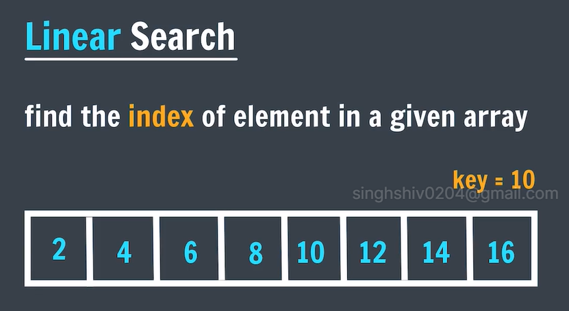
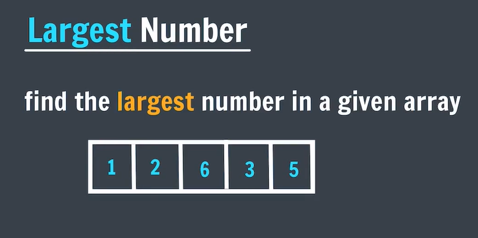
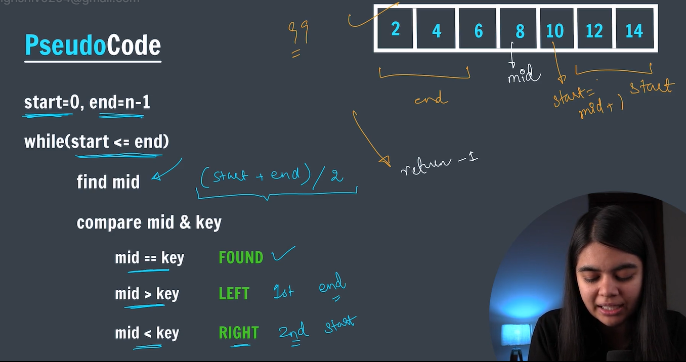
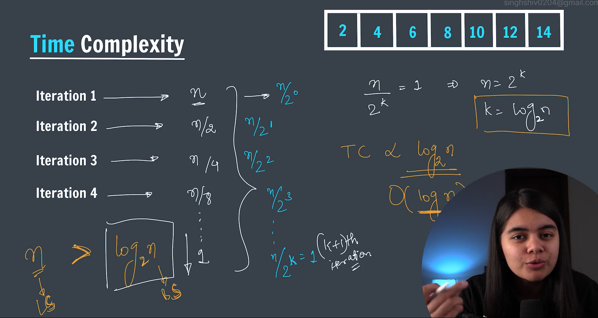
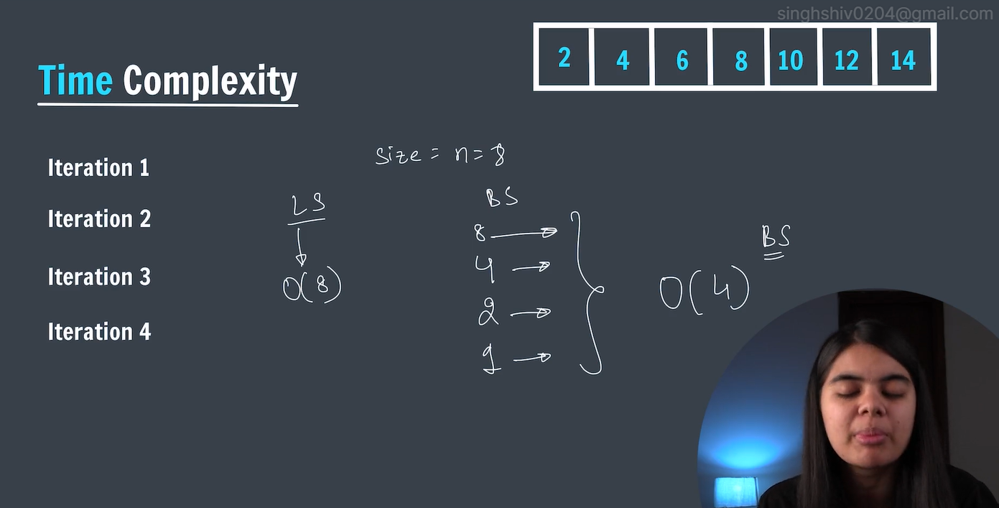
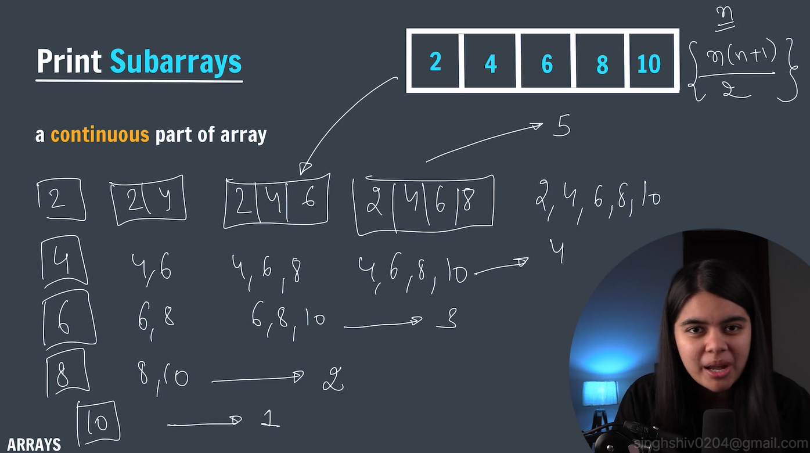
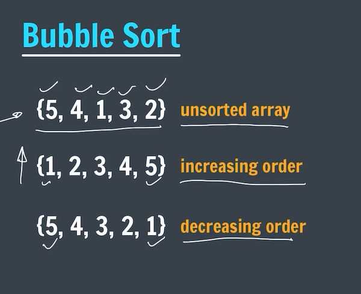
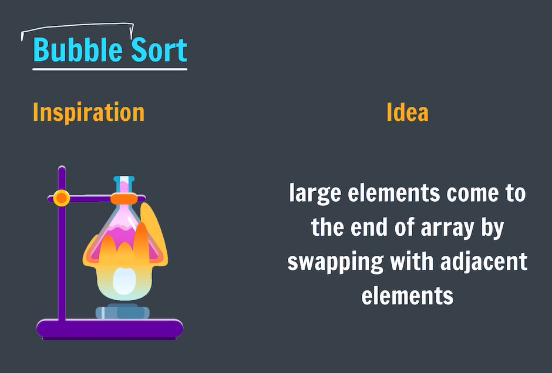

# Arrays :

Array is a list of element of the <mark>same</mark> type placed in a <mark>contiguous</mark> memory location.

- In java array indexing starts from 0 (zero).
- In memory every part of 1 byte.
- In java you can assume char takes 1 byte for simplicity.But Java char takes up 2 bytes in memory.
- type of Arrays is <mark> static </mark> means you can not change size in runtime.
- In Array default value:
  - int ==> 0
  - float ==> 0.0
  - String ==> ""
  - char ==> ''
  - boolean ==> false

## Operations in Arrays :

- **Create**
- **Input**
- **Output**
- **Update**

### Creating Array

<mark>dataType</mark> arrayName[] = new <mark>dataType</mark>[size];

- here **new** keyword allocate location in memory for array.
- here **size** is the size of array.
- We can find the length of array using <mark>.length</mark> property.

```java
// creating an array

int marks[] = new int[50];

int numbers[] = {1, 2, 3};

int moreNumbers[] = {4, 5, 6};

Stringvfruits[] = {"apple", "mango", "orange"};

 // Input/output and update
         int marks[] = new int[50];

         Scanner sc = new Scanner(System.in);
        //  int phy;
        //  phy = sc.nextInt();

        marks[0] = sc.nextInt(); // phy
        marks[1] = sc.nextInt(); //che
        marks[2] = sc.nextInt();//math

        System.out.println("phy : " + marks[0]);
        System.out.println("che : " + marks[1]);

        marks[2] = marks[2] + 1;
        System.out.println("math : " + marks[2]);

        int percentage = (marks[0] + marks[1] + marks[2])/3;
        System.out.println("percentage = " + percentage + "%");

        // length of array
        System.out.println(marks.length);
```

## Passing arrays as argument :

Arrays are passed by reference

```java
package Array;

import java.util.Scanner;

public class Array {
    public static void update(int marks[], int x){
         x = x*2;
        for(int i=0; i< marks.length; i++){
            marks[i] = marks[i] + 1;
        }
    }
    public static void main(String[] args) {
        // Passing arrays as argument
        int marks[] = {98, 99, 97};
        int nonChangable = 5;
        update(marks, nonChangable);

        //print our marks
        for(int i=0; i<marks.length; i++){
            System.out.print(marks[i] + " ");
        }
        System.out.println(nonChangable);
    }
}

```

## Linear Search :

**Time Complexity :** O(n)



### Largest and Smallest Number :

- -Infinity ==> Integer.MIN_VALUE
- +Infinity ==> Integer.MAX_VALUE  
  **Time Complexity:** O(n)

  

## Binary Search :

<mark> prerequisite - sorted arrays</mark>



```java

package Array;

public class BinarySearch {

    public static int binarySearch(int numbers[], int key){
        int start = 0, end = numbers.length-1;

        while(start <= end){
            int mid = (start + end)/2;

            //comparison
            if(numbers[mid] == key){ // found
                return mid;
            }
            if(numbers[mid] < key){
                start = mid+1;
            }else{
                end = mid -1;
            }
        }
        return -1;
    }
    public static void main(String[] args) {
        int numbers[] = {2, 4, 6, 8, 10, 12, 14};
        int key = 10;

        System.out.println("Index for key is : " + binarySearch(numbers, key));
    }
}

```

**Time Complexity of Binary Search** ==> O(log n)





**Total number of pairs in an Array: for n elements**  
`tp = n(n-1)/2`

## Print SubArray:

a continuous part of array



**Total number of subArrays in an Array: for n elements**  
`tp = n(n+1)/2`

"\n" ==> for new line.


# Sorting :
Arrange in a order.  
## Basic Sorting Algorithms :   

- **Bubble Sort**
- **Selection Sort**
- **Insertion Sort**
- **Counting Sort** (Advance)

## Bubble Sort :

  
  


